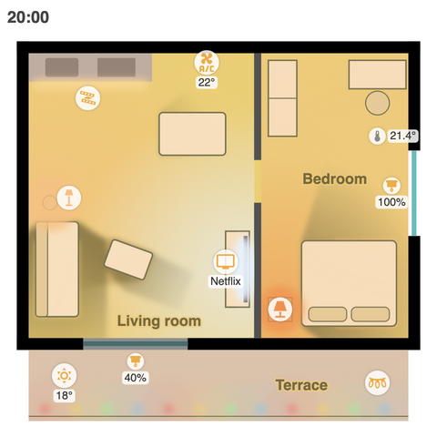
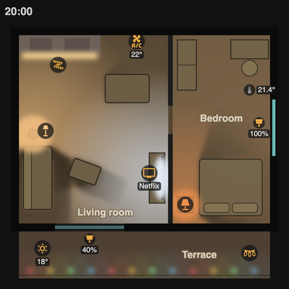
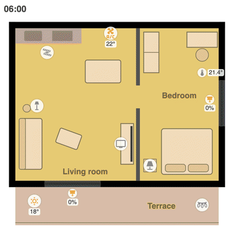
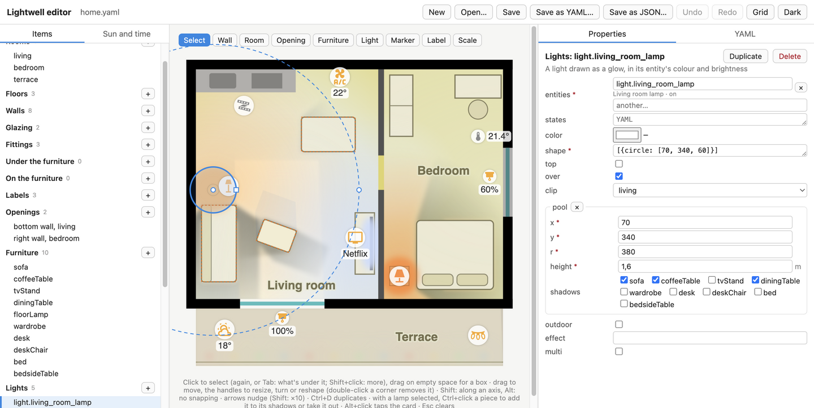
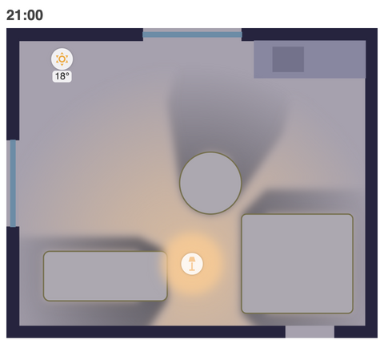

<p align="center"></p>

<h1 align="center">Lightwell</h1>

<p align="center"><b>A living floor plan for Home Assistant.</b><br>
Your home to scale, lit the way it is right now: lamps glow in their own colour and brightness, the sun and the daylight
come in through your windows and cast the furniture's shadows, blinds darken their window, and every device has a
marker you can tap.</p>

<p align="center">
  
  
</p>

<p align="center"><br>
<sub>A spring day in the example flat, hour by hour: the morning sun through the east window, noon through the
terrace door, the garden wall's shadow in the evening, then the lamps.</sub></p>

## What it does

- **Lights** glow in the colour and brightness their entity reports, kept inside their room. A lamp lights a pool on
  the floor around it, and the furniture casts soft shadows away from it, as long as the heights make one.
- **Effects** play: a light running a flow (by name, from your home's list) fades through its colours, a TV flickers
  while it's on, any other effect pulses.
- **The sun** comes in through each window and door from `sun.sun`'s position, on the side it's actually on. The patch
  is cut short by the blind's position, softened by clouds (`weather.home`) and by trees you describe, and the furniture
  and anything outside (a balcony wall, a fence) cast their shadows in it.
- **Daylight** spreads through the glass by day and on through open doors, and the floors are tinted for the time of
  day, from dawn's blue to the evening's orange.
- **Markers** show each device: tap toggles a light or a switch, wakes a device that's off (a Wake on LAN button), or
  opens its details. A label under the icon can show a state or an attribute, rounded, with a unit.
- **It follows the theme**, light or dark, and costs nothing while nothing changes: it renders only when one of its own
  entities does, and plays effects with a few redraws a second, pausing while it's off-screen.

## Install

**With HACS:** HACS → ⋮ → Custom repositories → add this repository's URL as a **Dashboard** repository, then install
**Lightwell**. HACS adds the resource for you.

**By hand:** copy `dist/lightwell-card.js` to `/config/www/`, then add it as a resource (Settings → Dashboards → ⋮ →
Resources → Add): URL `/local/lightwell-card.js`, type JavaScript module.

## Use it

Add a card to a dashboard, with your home in it:

```yaml
type: custom:lightwell-card
home_url: /local/my-home.json
```

| Option | |
| --- | --- |
| `home` | Your home itself, as YAML in the card's config. |
| `home_url` | Or a JSON file with it, for example under `/config/www/` (served as `/local/`). Handy for a long home, and it can live in git. |
| `north` | The compass bearing of the top of your plan, overriding the home's `sun.north` (useful while you calibrate it). |

A mistake in the home shows in the card, one line for each: an unknown room, a shadow from furniture that doesn't
exist, a malformed entity id.

> **YAML tip:** in Home Assistant's YAML, an unquoted `on` or `off` is read as true or false. Quote states: `'on'`.

The easiest way to describe your home is [the editor](#the-editor). Or copy [`example/home.yaml`](example/home.yaml),
the flat in the pictures, and change it by hand. Convert it to JSON for `home_url` with
`node tools/simulator/home-tool.mjs json my-home.yaml my-home.json` (which checks it too) or any YAML-to-JSON
converter, or paste it under `home:`.

## The editor

**[Open the editor](https://viktorbalog.github.io/lightwell-card/editor/)**: it runs in your browser, nothing to
install, and your home stays on your computer.

<p align="center"></p>

Draw your home over a picture of its plan and see the card light it as you go, under any sun, in light or dark:

1. **Start:** New → *Over a picture of its plan* (or drop the picture on the editor). Drag along something whose
   length you know, a wall or a door, and type it: that sets the scale. Or start empty, or from the example.
2. **Trace it** with the tools over the plan: walls (drag their box), rooms (a rectangle, or click the corners),
   windows and doors (drag along an outer wall: the side and thickness come from the wall), furniture, lamps, markers
   and labels. Everything snaps to the walls and to a 5 cm grid, with lengths shown in metres.
3. **Adjust:** click to select, drag to move, the handles to resize or turn; the panel on the right has every field,
   with your entities (by name and state), icons by search, a marker's label with the text it gives, and the effects
   with a preview. With a lamp selected, Ctrl+click a piece to add it to the lamp's shadows. Double-click a piece of
   furniture to edit what's drawn on it (cushions, devices, lines) in its own frame, turned with it; resizing a piece
   scales them with it (Alt: they stay). A path's points (and its curves' control points) are dragged one by one.
   A room's rectangles are listed in its form (+ adds one) and selected on their own (double-click one in a
   selected room). The sun's daylight spills and blockers are on the plan too, under the
   drawing (click again to reach them, or pick them in the list). The YAML tab shows the file itself, editable, and
   the card follows as you type.
4. **Save** it as YAML (your comments kept) or as JSON for `home_url`. Chrome and Edge save back to the same file;
   other browsers download it. The work in progress is kept in the browser, so a closed tab loses nothing.
5. **In Home Assistant:** put the JSON (and the picture, if it stays as the background) in `/config/www/`, and give the
   card `home_url: /local/my-home.json`.

**Your entities:** the pickers know the example's until you connect the editor to your Home Assistant (the button at
the top). You sign in on your Home Assistant's own login page, and the editor gets your entities, their live states and
your location for the sun. It only reads: taps on the card still act in the editor alone, and Disconnect revokes its
access. Browsers don't let a page on https reach a Home Assistant on plain http, so the hosted editor needs your
Home Assistant's https address (Nabu Casa, or your own certificate). For one on http in your network, serve the
editor from a clone of this repository (`python3 -m http.server` in it, then `http://localhost:8000/tools/editor/`).
Without connecting, a snapshot works too: `tools/simulator/snapshot.sh --home my-home.yaml --all`, then
`tools/editor/index.html?states=../simulator/states.js`.

## Describing your home

Everything is in your drawing's own units: pick any, such as centimetres or the pixels of a picture of your plan, and
say how many make a metre. x grows to the right, y downwards.

```yaml
view: {x: -20, y: -20, w: 890, h: 840}    # the part of the drawing the card shows
units_per_metre: 100
```

### Rooms

Light stays inside its room. A room is a list of rectangles `[x, y, w, h]`, or one polygon `[[[x, y], ...]]`. Rooms
can overlap: an open-plan living room and kitchen can be one room for the daylight and two for the lamps.

```yaml
rooms:
  living: [[25, 25, 475, 600]]
  terrace: [[[25, 650], [825, 650], [825, 800], [25, 830]]]
```

### Drawing

The plan itself, as lists of shapes in slots. Lightwell's own layers go between them, so that, say, a kitchen light
can shine over the counter while a floor lamp's glow stays under the furniture. From the bottom up:

`background` → **`floors`** → daylight and sun → lamps on the floor → **`walls`** → **`glazing`** → blinds →
**`fittings`** → lamps over the fittings (`top`) → the lamps' furniture shadows → **`under_furniture`** → furniture →
**`on_furniture`** → daylight on the furniture tops → lamps over the furniture (`over`) → **`labels`**

A shape is one of:

| Shape | |
| --- | --- |
| `rect: [x, y, w, h]` | with `rx` for round corners |
| `circle: [cx, cy, r]` | |
| `ellipse: [cx, cy, rx, ry]` | |
| `poly: [[x, y], ...]` | a polygon |
| `path: 'M0,0 H10'` | an SVG path |
| `text: Kitchen` | with `at: [x, y]` |
| `svg: '<g>…</g>'` | raw SVG, for anything else |

plus any SVG attributes, in snake_case: `class`, `fill`, `opacity`, `stroke_width`, `transform`, `style`…
`repeat: {count, step: [dx, dy]}` draws a shape several times; an attribute given as a list takes its values in turn
(`fill: ['#f00', '#0f0']`), which makes a string of coloured bulbs one line.

The classes take the theme's colours: `floor`, `wall`, `iwall` (inner walls), `fix` and `fix2` (fittings), `glass`,
`dev` (devices), `line` (thin lines), `room` (room names) and `lbl` (small labels). Furniture is `furn` and `furn2`.

```yaml
drawing:
  floors:
    - {rect: [25, 25, 800, 600], class: floor}
  walls:
    - {rect: [0, 0, 850, 25], class: wall}
    - {rect: [500, 25, 15, 225], class: iwall}
  glazing:
    - {rect: [140, 632, 220, 10], class: glass}
  labels:
    - {text: Living room, at: [300, 600], class: room}
```

**A picture instead:** `background: {image: /local/plan.png, rect: [x, y, w, h]}` lays a picture of your plan under
everything (filling the view if `rect` is left out), so you can skip drawing walls. It's tinted with the time of day
and dimmed in the dark theme. Draw in the picture's pixels; [`example/background/`](example/background/home.yaml) does.

<p align="center"></p>

### Openings

Windows and doors on the outer walls, where the sun and daylight come in. Each is on one wall side of the drawing:
`top`, `bottom`, `left` or `right`.

```yaml
openings:
  - {wall: bottom, at: 650, depth: 25, x: 140, w: 220, lo: 0, hi: 2.3,
     shutter: cover.living_room_blind, room: living, sky: living}
  - {wall: right, at: 850, depth: 25, y: 230, h: 180, lo: 0.8, hi: 2.2, room: bedroom, sky: bedroom}
```

| Field | |
| --- | --- |
| `wall` | the side of the drawing the wall faces out to |
| `at`, `depth` | the wall's outer face (a y for top and bottom, an x for left and right) and its thickness |
| `x`, `w` / `y`, `h` | where the opening is along the wall: `x` and `w` on a top or bottom wall, `y` and `h` on a left or right one |
| `lo`, `hi` | the glass, from and to that many metres above the floor |
| `shutter` | a cover entity: its position darkens the opening and shortens the sun's patch |
| `room` | the room the sun's patch falls in |
| `sky` | the room the daylight spreads over (default: `room`) |

### Furniture

Each piece once: its drawing, its shadows and the daylight on its top all come from the same entry.

```yaml
furniture:
  sofa: {shape: {rect: [40, 380, 90, 200], rx: 8}, height: 0.8, shadow_room: living}
  coffeeTable: {shape: {rect: [190, 430, 90, 60], rx: 6, turn: 20}, height: 0.45, shadow_room: living}
  bed:
    shape: {rect: [600, 420, 200, 180], rx: 10}
    height: 0.55
    shadow_room: bedroom
    extra:
      - {rect: [615, 560, 80, 30], class: furn2, rx: 10}
```

| Field | |
| --- | --- |
| `shape` | `{rect: [x, y, w, h], rx, turn}` (turned by `turn` degrees around its centre), `{circle: [cx, cy, r]}` or `{poly: [[x, y], ...]}` |
| `height` | in metres; only pieces with one cast shadows |
| `shadow_room` | the room its shadow in the sun stays in; without one, it casts none in the sun |
| `class` | `furn` (the default) or `furn2`, for smaller, darker pieces |
| `extra` | shapes drawn with it, turned with it: cushions, devices on it, lines |

### Lights

```yaml
lights:
  - entities: [light.living_room_lamp]
    shape: [{circle: [70, 340, 60]}]
    over: true
    clip: living
    pool: {x: 70, y: 340, r: 380, height: 1.6, shadows: [sofa, coffeeTable]}
  - entities: [media_player.tv]
    states: ['on', playing, paused]
    color: [170, 200, 255]
    effect: flicker
    shape: [{ellipse: [478, 480, 25, 70]}]
```

| Field | |
| --- | --- |
| `entities` | the first of them that is on lights it, in its colour (lights without a colour glow warm white) |
| `states` | what counts as on (default `['on']`) |
| `color` | `[r, g, b]`, for entities without a colour of their own |
| `shape` | shapes, blurred into a glow |
| `top`, `over` | draw it over the fittings, or over the furniture too; otherwise it's on the floor |
| `clip` | the room it stays in |
| `pool` | `{x, y, r, height, shadows}`: a soft pool of radius `r` around a light `height` metres up, with the furniture in `shadows` casting shadows away from it |
| `outdoor` | fades it out by day |
| `effect` | an effect it plays all the time it's lit |
| `multi` | keeps the shapes' own colours, for an on/off string of coloured bulbs |

### Effects

A light whose entity reports an `effect` plays it. `flicker` (a TV's light) is built in; add your own flows by name, as
steps of `[hue, saturation, brightness %, hold ms]`, each faded into in 666 ms (or `{fade, steps}` with a fade of its
own). Effects the card doesn't know pulse in the light's colour.

```yaml
effects:
  Sunset glow: [[25, 90, 90, 5000], [10, 85, 70, 5000], [40, 80, 100, 5000]]
```

### Markers

```yaml
markers:
  - {entity: light.living_room_lamp, x: 110, y: 330, icon: 'mdi:floor-lamp', tap: toggle}
  - {entity: climate.living_room, x: 400, y: 60, icon: 'mdi:air-conditioner',
     label: {attribute: temperature, round: 0, unit: '°'}}
  - {entity: media_player.tv, x: 440, y: 480, icon: 'mdi:television', label: {attribute: source, when: ['on']}}
```

| Field | |
| --- | --- |
| `entity`, `x`, `y`, `icon` | the marker; keep markers a little apart and off the room names |
| `icons` | `{state: icon}`; weather entities follow their condition on their own |
| `tap` | `toggle`, or (left out) open the entity's details |
| `small`, `side` | a smaller marker; the label to its right instead of below |
| `label` | the text under it: `entity` (read another entity), `attribute` (instead of the state), `round` (decimals), `unit`, `when` (only in these states of the marker's entity), `hide` (values never shown) |
| `active` | the states in which it shows as on (otherwise anything but off, idle, unavailable, unknown, closed or standby; sensors never) |
| `power`, `wake` | an entity that greys the marker out while it's off, and a button pressed on tap meanwhile instead of opening the details (wake a PC or a console) |

### Sun

```yaml
sun:
  north: 0
  blockers:
    - {rect: [825, 650, 25, 150], height: 2}
  trees: {from: 250, to: 290, top: 10, through: 0.4}
  spill:
    - {cx: 507, cy: 295, rx: 200, ry: 160, clip: bedroom, from: [0], k: 0.4}
  outdoor:
    - {rect: [25, 650, 800, 150], fill_opacity: 0.35}
```

| Field | |
| --- | --- |
| `north` | the compass bearing the top of your plan faces (0 if north is up). A map with your building's outline gives it best; a phone compass can be far off indoors |
| `entity`, `weather` | the sun and weather entities (default `sun.sun` and `weather.home`) |
| `blockers` | things outside that shade the openings, `{rect}` or `{poly}` with a `height` in metres |
| `trees` | a band of sky (azimuth `from`–`to`, up to `top` degrees high) where the sun is dimmed to `through` |
| `spill` | ellipses of daylight carried on through doors into rooms without windows, dimmed by the shutters of the openings in `from` (their positions in the list), `k` of the daylight getting through |
| `outdoor` | shapes in the sun whenever it's out (a terrace) |

### Palette

Colours for your own classes, or new ones for Lightwell's, in light and dark; `tinted` classes take the time of day's
tint like the floors (they need `#rrggbb` colours).

```yaml
palette:
  light: {terrace: '#d9cfc0'}
  dark: {terrace: '#3a352e'}
  tinted: [terrace]
```

## Tools

Open the pages in `tools/` straight from the files in a browser; nothing needs a server.

- **`editor/index.html`, [the editor](#the-editor)**, also [online](https://viktorbalog.github.io/lightwell-card/editor/).

- **`simulator/index.html`, the simulator:** your home with a made-up sun, also
  [online](https://viktorbalog.github.io/lightwell-card/simulator/) with the example. Pick a date and time (the sun is worked out for your
  location), which way the plan faces, the clouds, the blinds and the lights; tap markers to switch things. Time
  presets set the lights and blinds the way the home's `simulator.scenes` say:

  ```yaml
  simulator:
    scenes:
      Night: {lights: 'off', media: 'off', shutters: {cover.bedroom_blind: 0}}
      Dawn: Night
      Sunset: {lights: 'on', media: 'on'}
  ```

  It shows the example by default. For your own home: `node tools/simulator/home-tool.mjs js my-home.yaml my-home.js`,
  then `tools/simulator/snapshot.sh --home my-home.yaml` (with `HA_HOST` and `HA_TOKEN` set) for your real states and
  location, and open `index.html?home=my-home.js&states=states.js` (paths relative to the page). With `--all` after
  the home it saves every entity in Home Assistant, for the editor's pickers.
- **`simulator/bench.html` and `trace-report.cjs`:** how much work the card does, measured in a Chrome performance trace.
- **`simulator/ref.html` and `pngdiff.cjs`:** fixed scenes in light and dark, and a pixel-by-pixel comparison of two screenshots,
  to check a change doesn't change the looks.
- **`simulator/capture.html` and `scripts/pictures.sh`:** the pictures in this README.

The simulator's pages take `?card=`, `?tag=`, `?home=` and `?states=`; the editor `?states=`. They load scripts by
path only (`states.js`, `../../my/home.js`), never from another site.

`scripts/site.sh` builds the site the [Pages workflow](.github/workflows/pages.yml) publishes: the editor and the
simulator with the example homes.

## Development

```sh
npm install
npm test          # unit tests
npm run build     # dist/lightwell-card.js and the examples' home.js
npm run watch
```

What changed, release by release: [CHANGELOG.md](CHANGELOG.md).

The source is plain ES modules in `src/`, bundled by esbuild; `dist/lightwell-card.js` is committed, since HACS
installs it from the repository. Before changing how the card looks, take the reference screenshots (`ref.html`) and
compare after. The card must stay cheap: write to the DOM only through the helpers in `card.js`, which skip values
that didn't change, and don't animate with CSS or Web Animations.

## Licence

[MIT](LICENSE)
